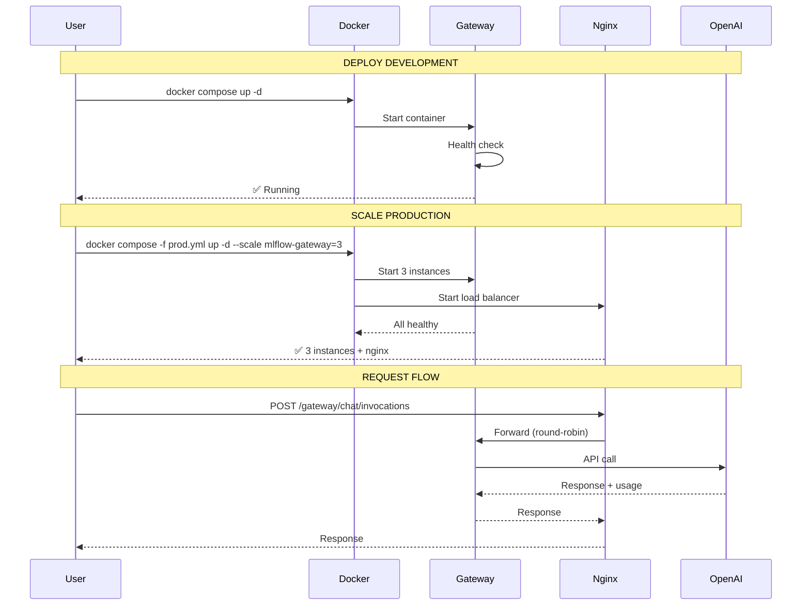
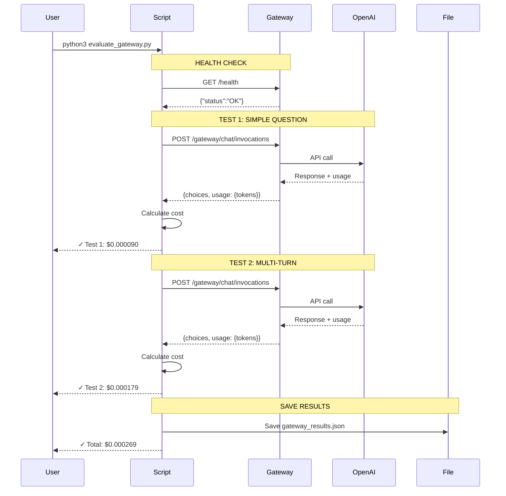
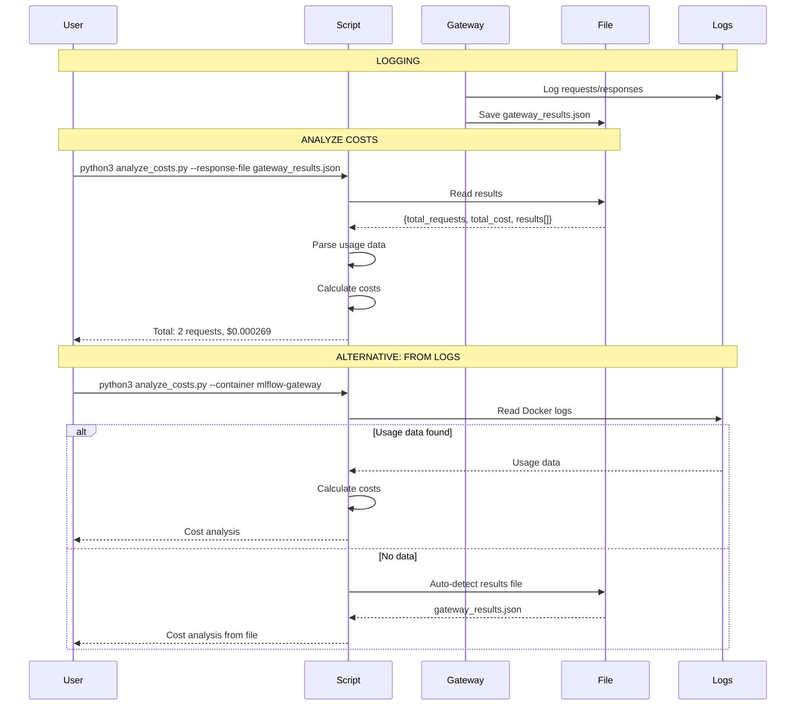
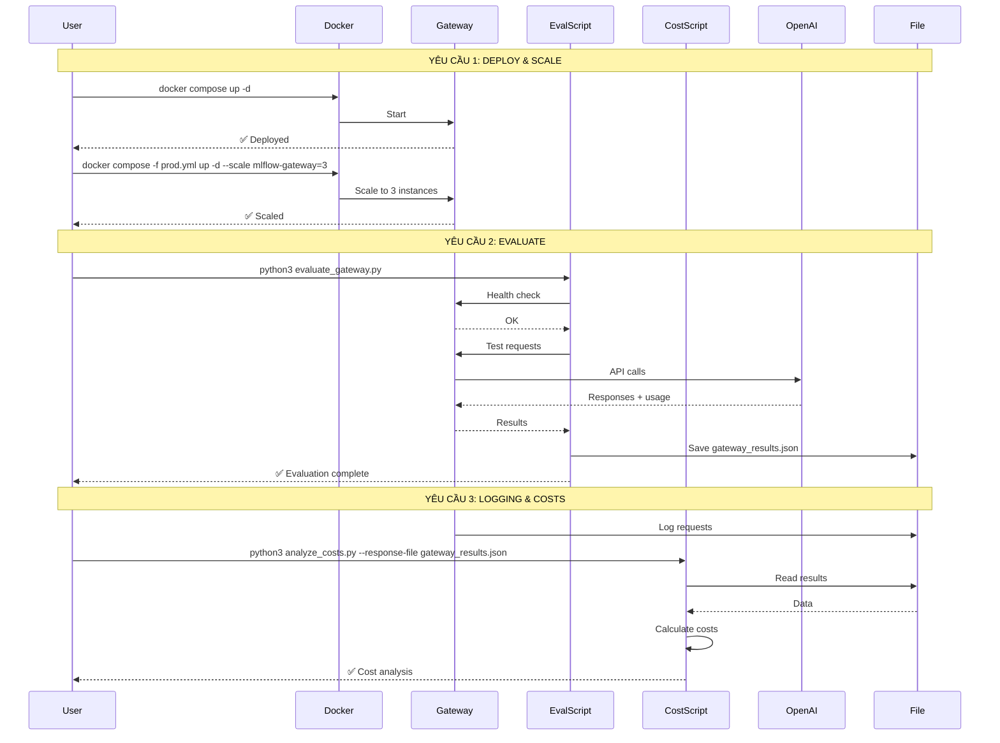
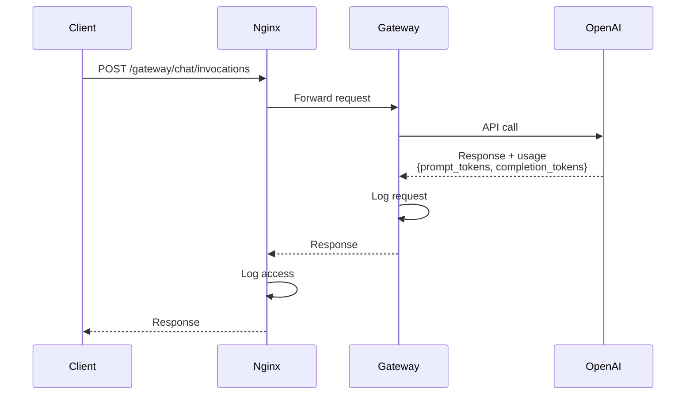
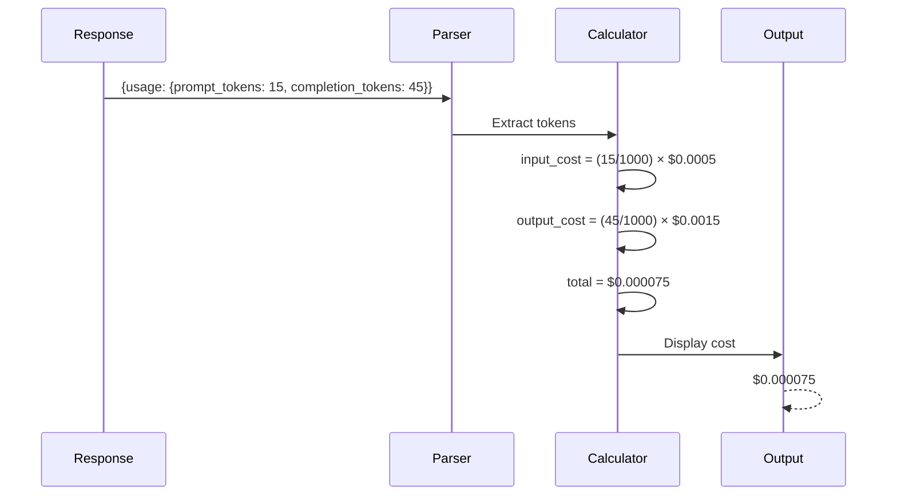
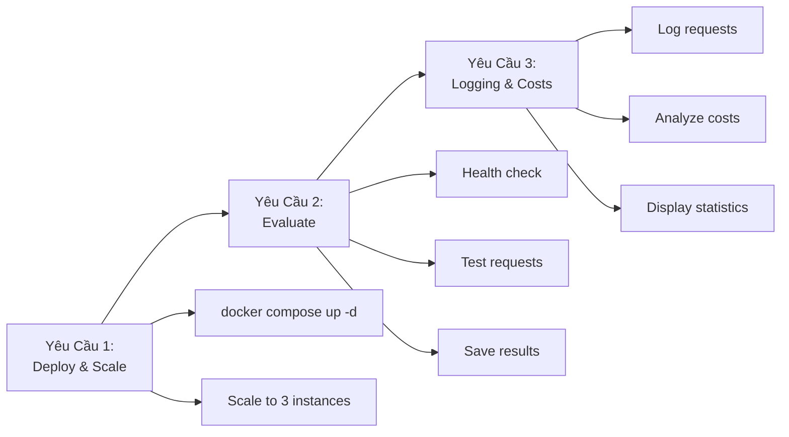

# SEQUENCE DIAGRAMS - MLFLOW AI GATEWAY

## 📊 Sequence Diagram 1: Deploy và Mở Rộng

---

## 📊 Sequence Diagram 2: Đánh Giá API Gateway

---

## 📊 Sequence Diagram 3: Logging và Phân Tích Chi Phí

---

## 📊 Sequence Diagram: Tổng Hợp 3 Yêu Cầu

---

## 📊 Sequence Diagram: Request Flow Chi Tiết

---

## 📊 Sequence Diagram: Cost Calculation

---

## 📝 Ghi Chú

### Các thành phần:
- **User**: Developer/User
- **Docker**: Docker Compose
- **Gateway**: MLflow Gateway
- **Nginx**: Load balancer
- **OpenAI**: External API
- **Script**: Python scripts
- **File**: Results file
- **Logs**: Docker logs

### Cách xem:
1. **VS Code**: Cài extension "Markdown Preview Mermaid Support"
2. **Online**: https://mermaid.live/
3. **GitHub/GitLab**: Xem trực tiếp (hỗ trợ Mermaid)

---

## 🎯 Tóm Tắt 3 Yêu Cầu

